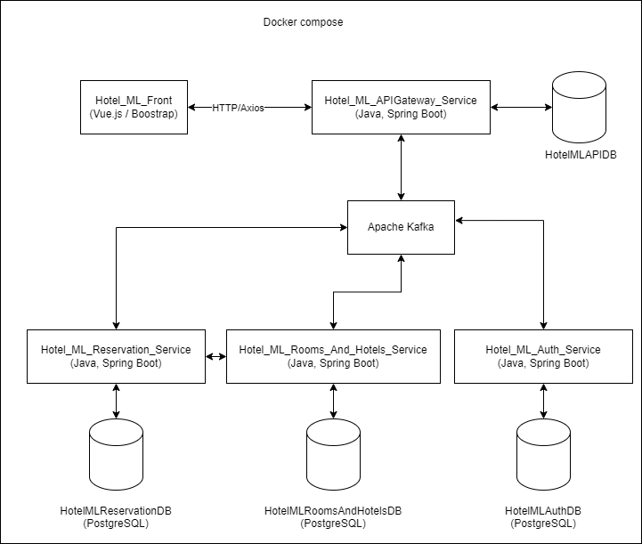
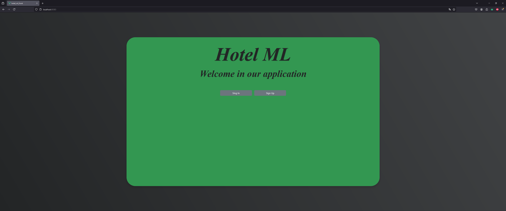
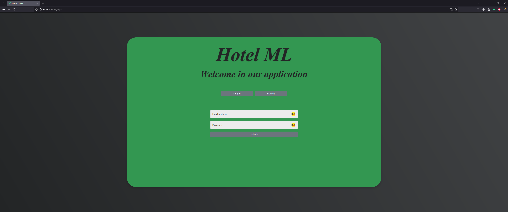
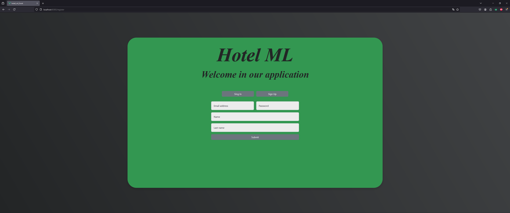

# 🏨 HotelML – Documentation & Architecture  

## 📖 Table of Contents
1. [📌 Overview](#-overview)
2. [📊 System Architecture ](#-system-architecture)
3. [📂 Structure of repositories](#-structure-of-repositories)
4. [▶️ How to Run the Entire System?](#️-how-to-run-the-entire-system)
5. [📸 Application screenshots](#-application-screenshots)

## 📌 Overview   
**HotelML** project was created to support the hotel infrastructure management process , developed as part of an engineering thesis. The system consists of multiple microservices that handle among other things, booking and adding rooms and hotels, the process of registering and logging users, modifying their data, creating and managing reservations.  

---

## 📊 System Architecture  
Below is a diagram showing the architecture of the system:

📌 **Architecture Diagram:**  
  

## 📂 Structure of repositories
The system includes the following microservices:

| Service | Description | Repository |
|---------|------------|------------|
| 💳 **hotel_ml_front** | Application UI | [Repo](https://github.com/NiczSpeed/hotel_ml_front) |
| 🏠 **Hotel_ML_APIGateway_Service** | Central API communication hub | [Repo](https://github.com/NiczSpeed/Hotel_ML_APIGateway_Service) |
| 📦 **Hotel_ML_Auth_Service** | User data management | [Repo](https://github.com/NiczSpeed/Hotel_ML_Auth_Service) |
| 🖥️ **Hotel_ML_Rooms_And_Hotels_Service** | Hotel and room management | [Repo](https://github.com/NiczSpeed/Hotel_ML_Rooms_And_Hotels_Service) |
| 🔄 **Hotel_ML_Reservation_Service** | Reservation management | [Repo](https://github.com/NiczSpeed/Hotel_ML_Reservation_Service) |

---

## ▶️ How to Run the Entire System?  
1️⃣ **Install Docker and Docker Compose**  
2️⃣ **Clone the repositories of all microservices:**  
```sh
git clone https://github.com/NiczSpeed/hotel_ml_front
git clone https://github.com/NiczSpeed/Hotel_ML_APIGateway_Service
git clone https://github.com/NiczSpeed/Hotel_ML_Auth_Service
git clone https://github.com/NiczSpeed/Hotel_ML_Rooms_And_Hotels_Service
git clone https://github.com/NiczSpeed/Hotel_ML_Reservation_Service
```
3️⃣ **Go to the Hotel_ML_APIGateway_Service repository:**
```sh
cd Hotel_ML_APIGateway_Service
```
4️⃣ **Build Docker Images for Microservices:**
```sh
docker-compose build 
```
5️⃣ **Build and start all microservices using Docker Compose:**
```sh
docker-compose up --build 
```

6️⃣ **Go to http://localhost:8080/**

## 📸 Application screenshots
### 🔹 Home page of a non-logged-in user


### 🔹 Login page


### 🔹 Registration page

